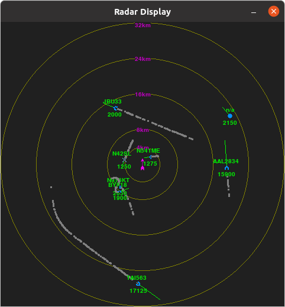

# pocket1090
Handheld Air Traffic Monitor using the dump1090-fa 1.09GHz SDR-based ADS-B and Mode S/3A/3C decoder

**WIP**

## Desktop version Screenshots

### Max Range

### Mid Range, Trails On

### Max Range, Trails On

## Key Features

### Range

* Manual: increase/decrease range
* Automatic: automatically select smallest range that includes all current tracks

### Trails (i.e., position points)

* show last 'N' position points (0 = no trails)

### Aging

* enable/disable fade-out with time since last seen

### Focus

* single track
* additional information

### Filters

* inside/outside altitude/speed range
* categories
* flight number (prefix)
* uniqueIds
* greater-/less-than distance
* heading

## Automatic Dependent Surveillance-Broadcast (ADS-B) Notes
* 1090MHz: Mode-A/C/S transponder
  - additional information (i.e., "extended squitter" message) aka 1090ES
  - aircraft flying above 18,000ft are required to have 1090ES
* 978MHz: Universal Access Transceiver (UAT)
  - aircraft flying above 18,000ft can have either UAT or 1090ES
* FLT ID: max of seven alphanumeric characters, same as id in ATC flight plan
  - commonly associated with airline and flight number (e.g., AAL3342)
  - for general aviation, its the aircraft's registration number
* ICAO address: 24b unique address, programmed at installation (like a MAC address?)
* in UAT Anonymous Mode, may not send ICAO address
* Unique Id starting with '~' means non-ICAO address -- e.g., TIS-B data coming from ground station?

#### Interesting Events Captured So Far
 * statistics
   - captured over four days
   - 52601 samples
   - 219 uniqueIds
* Categories
  - A[0-7]
  - B[1,2,4,6,7]
  - C[0-7]
  - D[1,2,7]
* Emergency/priority
  - no communications (7600)
  - lifeguard / medical emergency
* Groundspeed
  - min: 9.9 kt
  - max: 571.4 kt
* Baro altitude
  - min: -925 ft
  - max: 126700 ft
* RSSI
  - min: -20.3
  - max: -2.0

## Design Notes
* use dump1090-fa to emit json files, generate console display using matplotlib
* Main HW Components
  - LiPo battery, FlightAware Pro-Stick Plus, Raspi Zero, round LCD display with capacitive touchscreen and HDMI interface, external whip antenna, GPS receiver
* Display features:
  - concentric rings indicating range (device is in the center)
  - selectable range (between some min/max values that make sense)
  - use NATO symbology? -- shape indicates type, vector indicates heading and speed, text for other values
  - touch icon to get additional info pop-up
    * e.g., squawk, emergency, altitude, RSSI, roll, category, nav mode, seen, *_rate
  - age tracks by dimming them -- larger 'seen' value, the dimmer the track
* maybe a shaft-encoder or tiny joystick as additional input
* on-board LiPo charger and USB-C connection (power and RasPi interface)
* poll <path>/aircraft.json for data
* read <path>/receiver.json at startup to get receiver info (e.g., selected update rate)
* enable "track mode" where icon(s) leave slug trail behind?
* use color to indicate something interesting
  - e.g., emergency, special aircraft, really high/low/fast/slow/etc.
* use gps receiver to get location of device?
* use flux-gate magnetometer to get orientation?
  - select north is always up, or have the display reflect the device's current orientation
* use RasPi wifi to communicate with an external device (desktop, laptop, smartphone)
  - stream raw data
  - transfer history files
* save history files (with long save intervals)
  - enable offline analysis or replay of tracks
* set alarms -- things to watch for
  - e.g., specific planes, specific types of planes, specific metrics?
* switch to making auto-ranging the default
  - max range is always a power of two in Km
  - start with default range
  - after each polling cycle, determine max distance of all tracks, make max range be next higher power of two (in Km)
  - allow switching off autoRange (i.e., keep current range) and switching back on
  - turn off autoRange whenever range-up/down/reset/max command given
  - use last range or default range when no tracks available
* create different profiles for Handheld and Desktop uses -- do it all with config files
  - put screen size and where to get assets into config (use different sized symbols based on screen size)

### TODO

* Figure out what kind of input device to use -- e.g., track point, touchscreen, shaft-encoder
* Add UTC clock display (from GPS)
* Include simplified map?
* Change radar display if held vertically or horizontally?
* Make sure all temp files are written to appropriate file system
* adjust dump1090-fa so it generates output at appropriate intervals
* come up with simple way of defining filters
* indicate how many tracks are being filtered at any point in time?
* add secondary display (small OLED) for additional information
  - time (UTC) and location (lat/lon)
  - summary of current tracks: (flight number, category, altitude, speed, distance)
  - filtered tracks
  - details of selected track: (?)
* improve symbols
  - create different sized ones for different displays
  - use color and shape better
  - rotate (or not) properly
  - store different types in different places, put path in config

### RasPi Notes
* update pygame
  - Ubuntu: pygame 2.1.2 (SDL 2.0.16, Python 3.8.10)
  - RasPi: pygame 2.0.0 (SDL 2.0.14, python 3.9.2)
* must install 2.0 pygame: pip3 install pygame==2

* GPS
  - set up Serial Port for GPS
    * enable with "sudo rapsi-config"
      - "No" login shell
      - "Yes" keep serial port enabled
  - test GPS Serial connection with:
    * stty -F /dev/serial0 raw 9600 cs8 clocal -cstopb
    * cat /dev/serial0
      - should get text
  - install and use gpsd
    * sudo apt-get update; sudo apt-get install gpsd gpsd-clients
    * disable gpsd
      - sudo systemctl stop gpsd.socket
      - sudo systemctl disable gpsd.socket
    * manually start daemon
      - sudo gpsd /dev/serial0 -F /var/run/gpsd.sock
    * keep it running?
      - sudo systemctl enable gpsd.socket
      - sudo systemctl start gpsd.socket
  - run desktop client
    * sudo cgps -s
  - gpsd installs python package
    * from gps import *
  - can install adafruit-circuitpython-gps
    * import adafruit_gps
  --> running gpsd incurs a constant cpu load and so would rather just query on-demand
    * need to use library that works without gpsd
      - pip install adafruit-circuitpython-gps
      - pip install pynmeagps
      - from serial import Serial
        import adafruit_gps
        from pynmeagps import NMEAReader
        uart = Serial(port="/dev/ttyAMA0", baudrate=9600, timeout=30)
        gps = adafruit_gps.GPS(uart, debug=False)
        stream = Serial('/dev/ttyAMA0', baudrate=9600, timeout=3)
        nmr = NMEAReader(stream)
        (raw, parsed) = nmr.read()
  - NEMA 0183 parsing
    * $GPGGA,181908.00,3404.7041778,N,07044.3966270,W,4,13,1.00,495.144,M,29.200,M,0.10,0000*40
      - $GPGGA: message with fix data
        *'GP' means GPS, 'GL' means GLONASS
      - MsgId:
        * VTG: Course over ground and ground speed
        * GSV: GPS Satellites in view
        * RMC: Recommended Minimum Specific GPS Data -- UTC time, status, latitude, longitude, speed over ground, date, magnetic variation of position
        * GSA: GPS DOP and Active Satellites
        * GGA: GPS Fix Data
          - UTC of position fix in HHMMMSS.SS format
          - Latitude in DD MM,MMMM format (0-7 decimal places)
          - direction of latitude: 'N', 'S'
          - Longitude in DD MM,MMMM format (0-7 decimal places)
          - direction of longitude: 'E', 'W'
          - GPS Quality indicator:
            * 0: invalid
            * 1: GPS fix
            * 2: DGPS fix
            * 3: ?
            * 4: real-time kinematic, fixed integers
            * 5: real-time kinematic, float integers
          - Number of SVs in use: [00-12]
          - HDOP
          - Antenna height -- MSL reference
          - "M": meters
          - Geoidal separation
          - "M" indicates the Geoidal separation is in meters
          - Correction age of the GPS data record: Null when not using DGPS
          - Base Station ID: [0000-1023]
        * RMC: Minimum GPS Data
          - UTC of position fix in HHMMMSS.SS format
          - Status: 'A'=valid, 'V'=invalid
          - Latitude coordinate (0-7 decimal places)
          - Latitude direction: 'N', 'S'
          - Longitude coordinate (0-7 decimal places)
          - Longitude direction: 'E', 'W'
          - Speed over Ground in knots (0-3 decimal places)
          - Track Made Good, True, in degrees
          - Date in dd/mm/yy format
          - Magnetic variation in degrees
    * looks like I receive as many RMC and GGA messages, so I'll use the GGA messages
      while True:
        _, p = nmr.read()
        if p.msgID == "GGA":
    * filter (lat,lon) samples (assuming not near poles/equator/where discontinuities occur)
      - look at set of samples
        * import matplotlib.pyplot as plt
          plt.scatter(x=lat,y=lon)
          avgLat = sum(lats)/len(lats)
          avgLon = sum(lons)/len(lons)
          plt.plot(avgLat, avgLon, marker="x")
          plt.show()
      - ????
    * add map overlays?
      - get map rectangles from https://openstreetmap.org
        * export image as .png file with Export button
        * define bounding box with min/max lat/lon values
          - fixed size (e.g., 64km on a side) from given center point?
      - load image with: myMap = plt.imread(<path>)
* IMU
  - set up I2C for IMU
    * I2C HW: SCL=3, SDA=2
    * Raspi doesn't do I2C clock stretching properly so have to do something else
      - could switch and use the IMU in serial mode (with the second HW UART?)
    * replace i2c device with bit-banging driver (using same pins) via device tree overlay
      - sudo raspi-config
      - Interfaces->I2C -- disable ('<NO>')
      - sudo cp /boot/config.txt /boot/config.txt.orig
      - sudo ex /boot/config.txt
        * add: dtoverlay=i2c-gpio,bus=3,i2c_gpio_sda=02,i2c_gpio_scl=03
      - reboot and "ls -l /dev/i2c*" look for /dev/i2c-3
        * crw-rw---- 1 root i2c 89,  3 Dec 1 18:30 /dev/i2c-3
      - verify with: i2cdetect -y -r 3
        * should show BNO055 at address 28
    * alternatively use second HW UART and strap BNO055 to use serial (instead of I2C)
  - sudo pip3 install Adafruit-Blinka
    import board
    import busio
    i2c = busio.I2C(board.SCL, board.SDA)
  - sudo pip3 install adafruit-bno055
  - sudo pip3 install adafruit-bno055
  - from Adafruit_BNO055 import BNO055
    bno = BNO055.BNO055(address=0x28, i2c="/dev/i2c-3", rst=5)
    if not bno.begin():
      print("ERROR: failed to init")
  - consider getting this: http://gps-pie.com/L80_slice.htm

* dump1090-fa
  - get and build dump1090-fa
    * git clone git@github.com:flightaware/dump1090.git
    * sudo apt-get install build-essential fakeroot debhelper librtlsdr-dev pkg-config libncurses5-dev libbladerf-dev libhackrf-dev liblimesuite-dev
    * ./prepare-build.sh bullseye
    * cd package-bullseye
    * dpkg-buildpackage -b --no-sign
  - run dump1090-fa
    #### FIXME figure out how much to write and where
    * /home/jdn/Code2/dump1090/dump1090 --write-json /tmp/ > /tmp/fa.txt

* run pocket1090
  - sudo apt install libsdl2-ttf-2*
  - pip3 install geopy gps pygame pyYaml
  - ./pocket1090.py -v /tmp -L INFO

--------------

* egrep RSSI /tmp/fa.txt | cut -d ":" -f 2 | cut -d " " -f 2 | awk '{cnt += 1; sum += $1} END {print "Avg RSSI: " sum/cnt " dBFS"}'
  - Avg RSSI: -10.8692 dBFS

