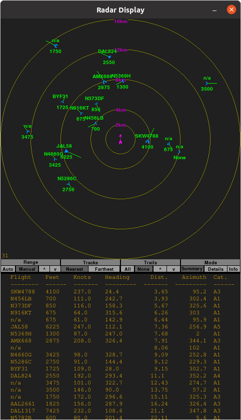

# pocket1090
Handheld Air Traffic Monitor using the dump1090-fa 1.09GHz SDR-based ADS-B and Mode S/3A/3C decoder

**WIP**

## Desktop version Screenshots

## Automatic Dependent Surveillance-Broadcast (ADS-B) Notes
* 1090MHz: Mode-A/C/S transponder
  - additional information (i.e., "extended squitter" message) aka 1090ES
  - aircraft flying above 18,000ft are required to have 1090ES
* 978MHz: Universal Access Transceiver (UAT)
  - aircraft flying above 18,000ft can have either UAT or 1090ES
* FLT ID: max of seven alphanumeric characters, same as id in ATC flight plan
  - commonly associated with airline and flight number (e.g., AAL3342)
  - for general aviation, its the aircraft's registration number
* ICAO address: 24b unique address, programmed at installation (like a MAC address?)
* in UAT Anonymous Mode, may not send ICAO address

#### Interesting Events Captured So Far
 * statistics
   - captured over four days
   - 52601 samples
   - 219 uniqueIds
* Categories
  - A[0-7]
  - B[1,2,4,6,7]
  - C[0-7]
  - D[1,2,7]
* Emergency/priority
  - no communications (7600)
  - lifeguard / medical emergency
* Groundspeed
  - min: 9.9 kt
  - max: 571.4 kt
* Baro altitude
  - min: -925 ft
  - max: 126700 ft
* RSSI
  - min: -20.3
  - max: -2.0

## Design Notes
* use dump1090-fa to emit json files, generate console display using matplotlib
* Main HW Components
  - LiPo battery, FlightAware Pro-Stick Plus, Raspi Zero, round LCD display with capacitive touchscreen and HDMI interface, external whip antenna, GPS receiver
* Display features:
  - annular rings indicating range (device is in the center)
  - selectable range (between some min/max values that make sense)
  - use NATO symbology? -- shape indicates type, vector indicates heading and speed, text for other values
  - touch icon to get additional info pop-up
    * e.g., squawk, emergency, altitude, RSSI, roll, category, nav mode, seen, *_rate
  - age tracks by dimming them -- larger 'seen' value, the dimmer the track
* maybe a shaft-encoder or tiny joystick as additional input
* on-board LiPo charger and USB-C connection (power and RasPi interface)
* poll <path>/aircraft.json for data
* read <path>/receiver.json at startup to get receiver info (e.g., selected update rate)
* enable "track mode" where icon(s) leave slug trail behind?
* use color to indicate something interesting
  - e.g., emergency, special aircraft, really high/low/fast/slow/etc.
* use gps receiver to get location of device?
* use flux-gate magnetometer to get orientation?
  - select north is always up, or have the display reflect the device's current orientation
* use RasPi wifi to communicate with an external device (desktop, laptop, smartphone)
  - stream raw data
  - transfer history files
* save history files (with long save intervals)
  - enable offline analysis or replay of tracks
* set alarms -- things to watch for
  - e.g., specific planes, specific types of planes, specific metrics?

--------------

* egrep RSSI /tmp/fa.txt | cut -d ":" -f 2 | cut -d " " -f 2 | awk '{cnt += 1; sum += $1} END {print "Avg RSSI: " sum/cnt " dBFS"}'
  - Avg RSSI: -10.8692 dBFS

